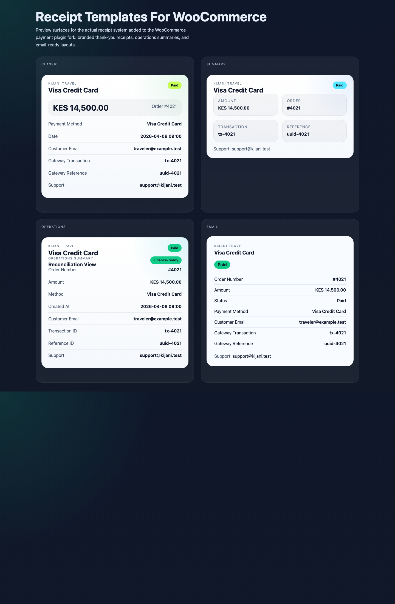
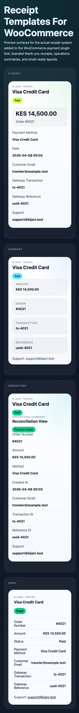

# Whitelabel WooCommerce Payment Provider Extension

## Requirements

- PHP 7.1+
- [Composer](https://getcomposer.org/doc/00-intro.md#system-requirements)
- [WooCommerce 3.7+ Requirements](https://docs.woocommerce.com/document/server-requirements/)

## Build

* Clone or download the source from this repository.
* Comment/disable adapters in [`src/classes/includes/payment-gateway-cloud-provider.php`](src/classes/includes/payment-gateway-cloud-provider.php) - see `paymentMethods()` method.
* Run the build script to apply desired branding and create a zip file ready for distribution:
```shell script
php build.php gateway.mypaymentprovider.com "My Payment Provider"
```
- Verify the contents of `build` to make sure they meet desired results.
- Find the newly versioned zip file in the `dist` folder.
- Test by installing the extension in an existing shop installation (see [src/readme.txt](src/readme.txt)).
- Distribute the versioned zip file.

## Docker

We supply ready to use Docker environments for development & testing. Please take a look at the supplied [docker](docker) directory for instructions.

## Local Testing

- Install the repo-level development dependencies:
```shell
composer install
```
- Run the unit tests for the extracted WooCommerce integration helpers:
```shell
composer phpunit
```

These tests intentionally live at the repository root so the distributable WordPress plugin package under [`src`](src) remains unchanged.

## Modernization Highlights

- extracted gateway client, customer, transaction, and callback concerns into dedicated helpers
- added a repo-level PHPUnit workflow for the extracted integration helpers
- added selectable IXOPAY receipt templates on the WooCommerce order-received page
- added branded email receipt rendering for customer order emails
- added admin-configurable receipt branding fields for brand name, support email, and accent color
- fixed the cart-clearing success redirect flow

## Receipt Template Preview

Preview source:
- [`docs/receipt-preview.html`](docs/receipt-preview.html)

Desktop:



Mobile:



## Provide Updates

- Fetch the updated source from this repository (see [CHANGELOG](CHANGELOG.md)).<br>Note: make sure to not overwrite any previous changes you've made for the previous version, or re-apply these changes.
- Run the build script with the same parameters as the first time:
```shell script
php build.php gateway.mypaymentprovider.com "My Payment Provider"
```
- Find the newly versioned zip file in the `dist` folder.
- Test by updating the extension in an existing shop installation (see [src/readme.txt](src/readme.txt)).
- Distribute the newly versioned zip file.
